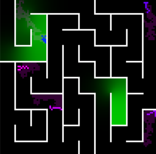

# Bacteria Maze

  

This simulation uses bacteria-like movement and chemotaxis to get agents to navigate a maze.

The bacteria are represented by the worm like objects in the maze. To move, each agent would select an occupied pixel that has a poor value to remove and would select an empty pixel with a good value to add, while maintaining connectedness of the pixels it is occupying.

The agent leaves a slime trail (maroon pixels) to mark where it has been, while the green substance is the attractant that draw the bacteria towards and spreads using Fick's law of diffusion. There however exists a threshold of attractant concentration below which the agent would not be able to sense the attractant. When it does sense the attractant, the agent turns into a hue of blue, otherwise has a hue of purple. The value function of the pixels that the agent is occupying and potential pixels that it could occupy, is a function of the amount of attractants and slime is present in that pixel. The value function is positively correlated to the amount of attractant to allow the bacteria to be attracted to it. On the other hand, the value function is negatively correlated to the amount slime to discourage the bacteria from traversing pixels it once occupied.

To run the simulation run `python main.py` in the command prompt.
